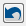

===============================================
*Geogig Local Client: Simplified Geogig Plugin*
===============================================

:Author: Markus Hesse
:Date: $Date: 2017-11-22 10:17:45 +0000 (Wed, 22 Nov 2017) $
:Version: $Revision: 1.0 $
:Description: Prerequisites, Installation and Handling

Introduction
------------

The *Simplified Geogig Plugin* provides an alternative or addition for the existing Geogig Plugin (see https://github.com/boundlessgeo/qgis-geogiglight-plugin). It is designed for the daily work of a gis operator. With it he can do the following things:

- Check in changes and synchronize between local geo package databases and server repository.
- Follow changes and handle conflicts.
- Create branches and navigate between the branches. 

Explicitly not intended are administrative tasks:

- Configure connection to server and repositories.
- Download layers to current project.

Compared to the existing Geogig plugin the following simplifications are implemented:

- The current branch is stored persistently. 
- A commit is always done to the current branch. 
- Merges from and to the current branch are only possible for defined parent and child branches of the current branch. (Geogig allows to merge between arbitrary branches. This is limited here.)
- All commit and merge actions as well as the navigation between the branches is performed on all layers of the repository. (With the existing plugin this has to be done for each layer separately.)

Prerequisites
-------------

To use the *Simplified Geogig Plugin* you need a Geogig server who provides the repositories to be worked on. To install that, please read:

- http://geogig.org/docs/index.html

and especially

- http://geogig.org/docs/interaction/networking.html

Installation of the plugins
--------------------------- 

Install fist the existing geogig plugin and its required plugin

- https://github.com/boundlessgeo/lib-qgis-commons
- https://github.com/boundlessgeo/qgis-geogiglight-plugin

In detail:

*lib-qgis-commons*: 

- Download the sources from https://github.com/boundlessgeo/lib-qgis-commons
- Copy from ..\\lib-qgis-commons\\qgiscommons2 into the QGis plugin directory (c:\\Users\\<user>\\.qgis2\\python\\plugins)

*qgis-geogiglight-plugin*

- Download the sourcen from https://github.com/boundlessgeo/qgis-geogiglight-plugin
- Installation according the description on that page (i.e. initial istallation of ``paver``, then ``paver setup`` and ``paver install``)

After that you can install the Simplified Geogig Plugin.

- Download vfrom https://github.com/SWM-IT/qgis-netze-gas
- Copy the folder ...\\qgis-netze-gas\\source\\examples\\python\\plugins\\GeogigLocalClient into the QGis plugin directory (c:\\Users\\<user>\\.qgis2\\python\\plugins)

Switch the QGis plugins *GeoGig Client* and *Geogig Local Client* active: ``Erweiterungen\Erweiterungen verwalten und installieren...'', search for geogig.

Preparations of the repositories
--------------------------------

Use the existing geogig plugin to configure the connection to the geogig server and the repositories. After that download the wanted layers to you project. For details see https://github.com/boundlessgeo/qgis-geogiglight-plugin/blob/master/docs/source/usage.rst.

Work with the plugin
--------------------

You can start the plugin by ``Datenbank\Geogig Local Client\GeoGig Manager`` or by the symbol ``GeoGig Manager`` in the toolbar.
The following dialog opens:

 .. image:: images/geogig/GeoGigManagerDialog.png

With the two pulldown menus in the first line you can select the GeoGig server and the wanted repository. Of course these need to be configured in advance (see ``Preparations of the repositories``):

The subsequent buttons in the first line have have the following functions:

| |BtnSync|       : Synchronize local changes and the changes of the server in the current branch.
| |BtnMergeDown|  : Merge changes of the parent branch to the current branch.
| |BtnMergeUp|    : Merge changes of the current branch to the parent branch.
| |BtnRevert|     : Revert local changes that are not yet sent to the server.
| |BtnShowChanges|: Shows local changes that are not yet sent to the server.

Below the first line there is the window with the branches tree. The root of all branches is ``master``. From here sub branches can be created in a hierarchical manner. The current branch is emphasized by a bold and bigger font (in snapshot above ``B6``).

By a right click on a branch, you get the following popup menu:

 .. image:: images/geogig/BranchesPulldown.PNG

Die Funktionen darin sind:

- **Goto this Branch**: Go to this branch with all layers and make this branch the current branch. A progress abr above the map shows the progress of this action (one step for each layer). The selected branch will the will be shown in a bold and bigger font as the current branch. Subsequent merge and sync actions will now work with this branch.
- **Create branch**: Create a sub branch to the selected branch. Note: You can cretae a sub branch to any branch you select and not only for the current branch.
- **Delete branch**: Delete the selected branch. Note that you can delete any branch you select, no only the current branch. A deletion of ``master`` is not possible. If the selected branch has sub branches, an additional request to the user is shown. If he agrees, the selected branch and all sub branches are deleted. 

Note to branch hierarchy:
     
     In Geogig there is actually no hierarchy between the branches. All branches are equal and the user can merge from any branch to any branch. To simplify the handling for the user, we implemented here a hierarchy. Technically this is done by a naming convention: The root branch is ``master``. Branches with simple names are direct children of master. Any branch below has the name of its parent included in its name with the following notation: "<own name>_($parent name$)". in the plugin ony <own name> is shown.

Below the window with the branches there is the window with the commit history. When you select a branch in the upper window, the lower window show the list of commits for this branch. By a right click on a commit you get the following popup menu:

 .. image:: images/geogig/CommitsPulldown.PNG

The function are:

- **Create branch from this commit**: Create a sub branch of the selected branch based on the selected commit.
- **Show changes of this commit**: Open a new menu showing the changes stored by this commit.
- **Show details of this commit**: Open a new menu with detail information on the branch, e.g. author and date.
- **Create tag**: Create a tag to this commit.
- **Delete tag**: Delete all tags of this commit.
	  
